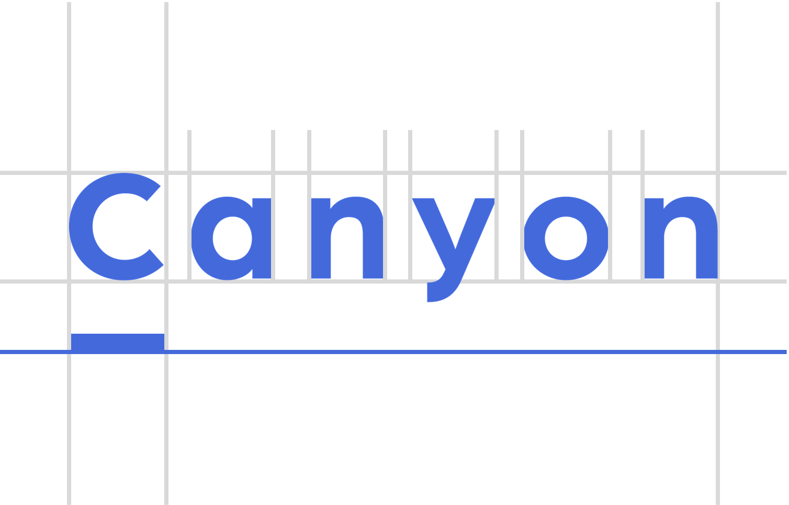
# Canyon(キャニオン)
## Canyonとは
Canyonは、MDからスライドデッキを生成できるフレームワークであるMarp用のスライドテンプレートです。

## Canyonのコンセプト
大きなスクリーンでの印象的なスライドショーというよりかは、進捗報告会のような、まとまりのあるスライド資料を作るために開発されたスライドテンプレートです。

## Canyonの特徴
見出しや画像とかの他に、色の付いたボックスやタグ等の部品(コンポーネント)を含み、素早くかつリッチなスライド資料を、デザインについて考えることなく直感的に追加出来ます。またタイトルスライドや補足説明用のスライドデザイン等も利用できます。

# Canyonの使い方
## Canyon紹介スライド
slide.pdfはCanyonで作られた、Canyonの紹介資料です。特徴と使えるコンポーネント等を紹介しています。なお、このスライドのソースコードはslide.mdにあります。

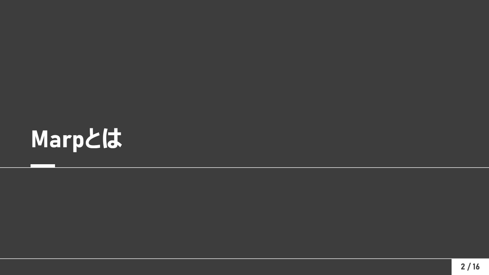
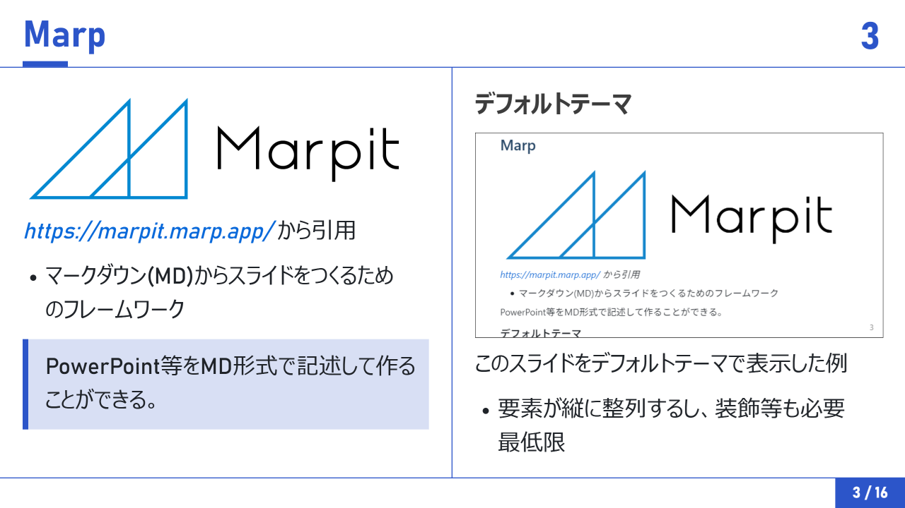
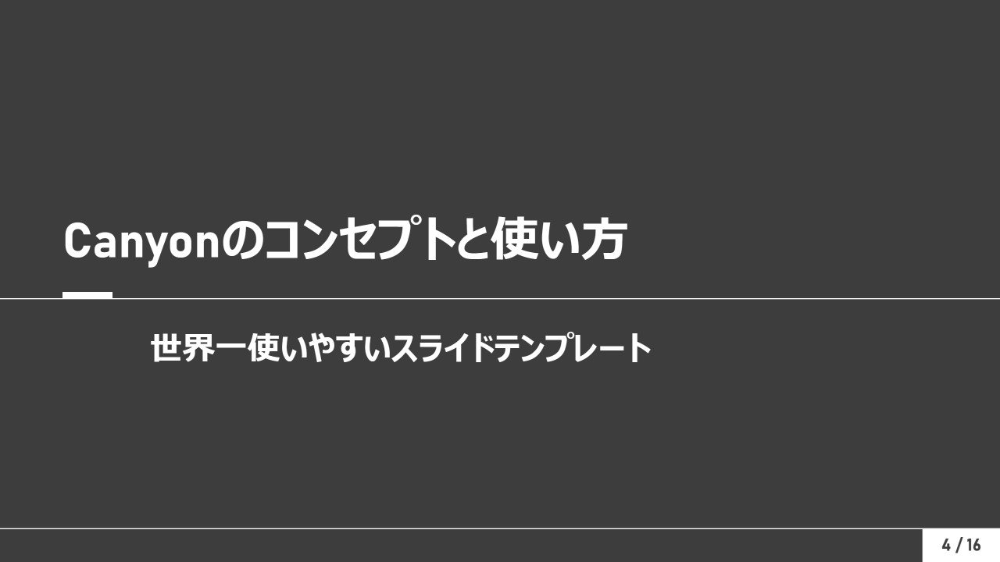
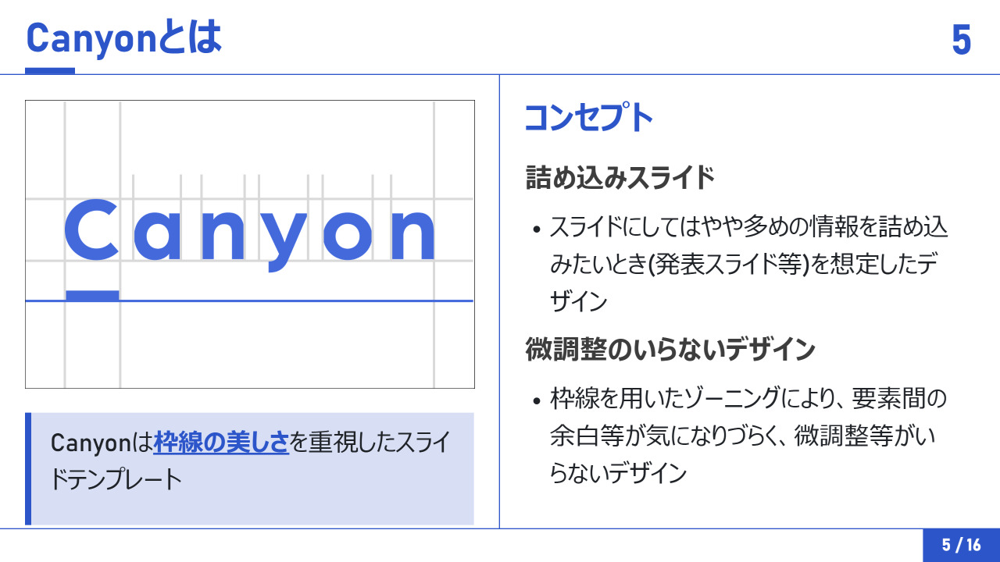
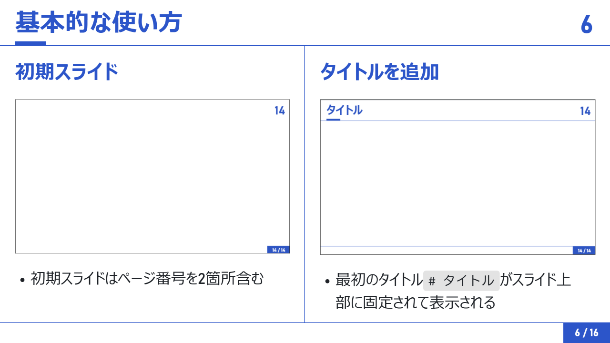
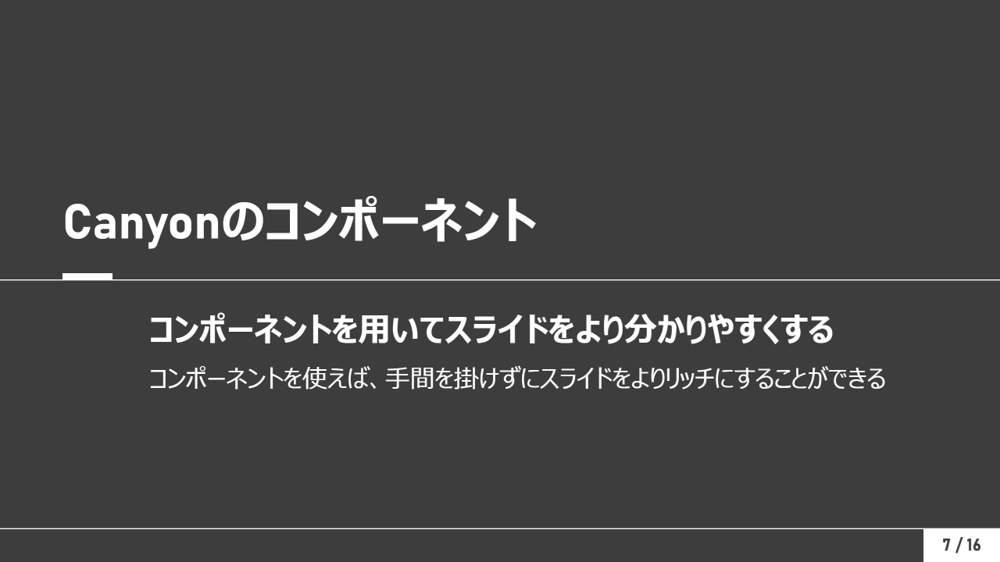
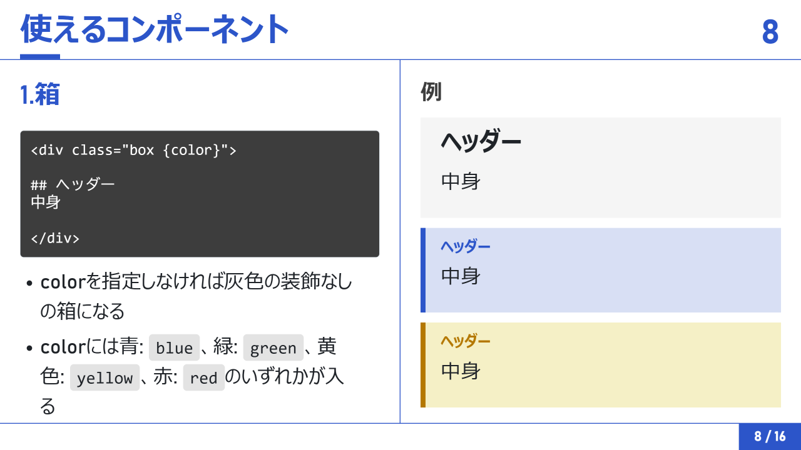
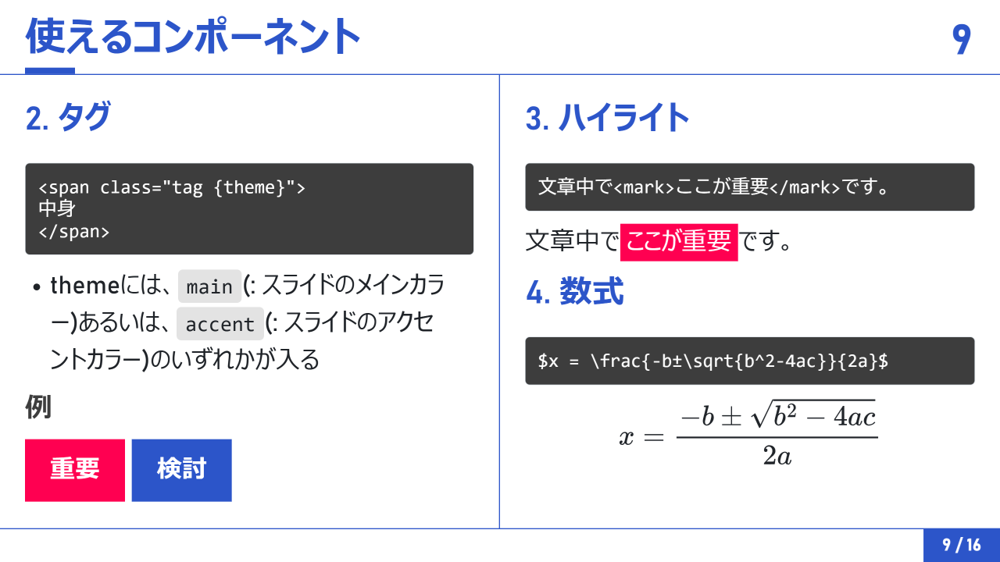
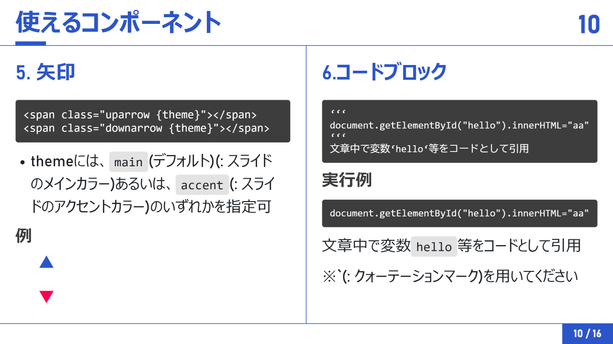
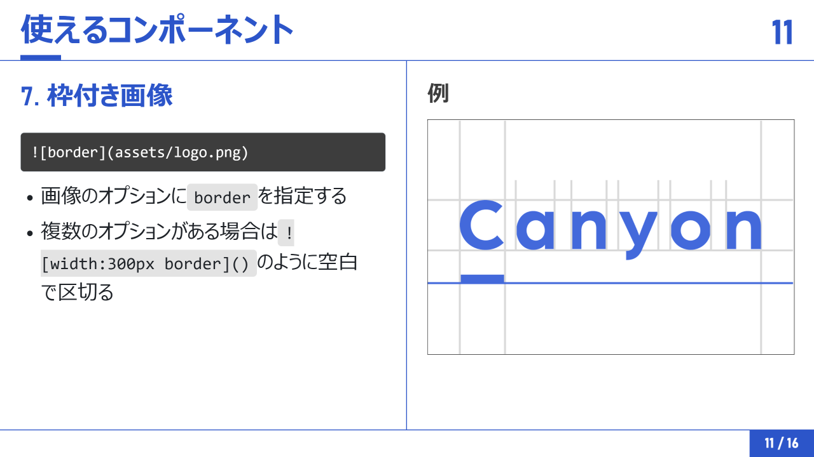
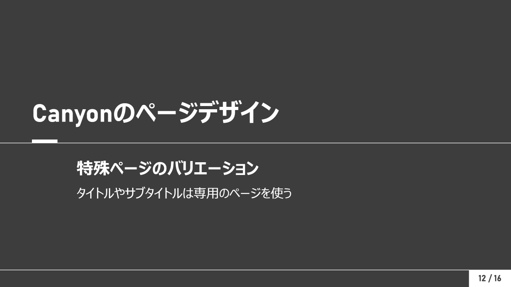
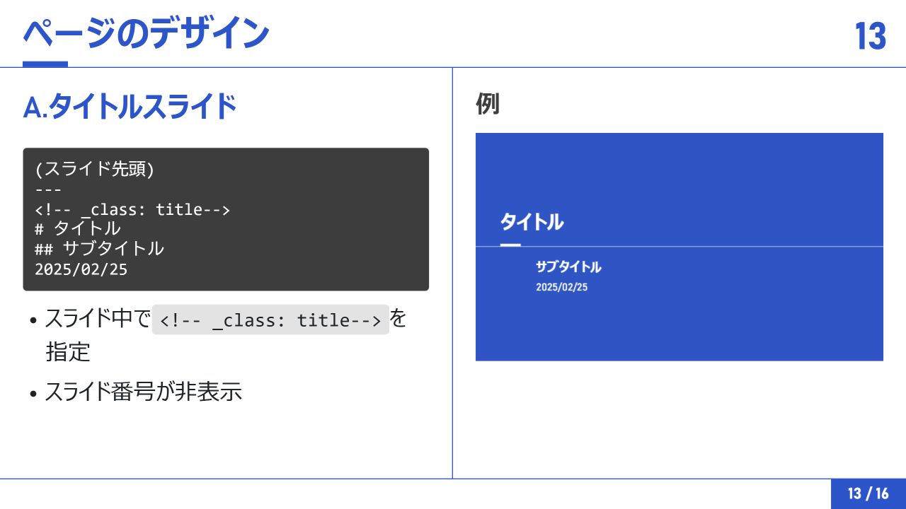
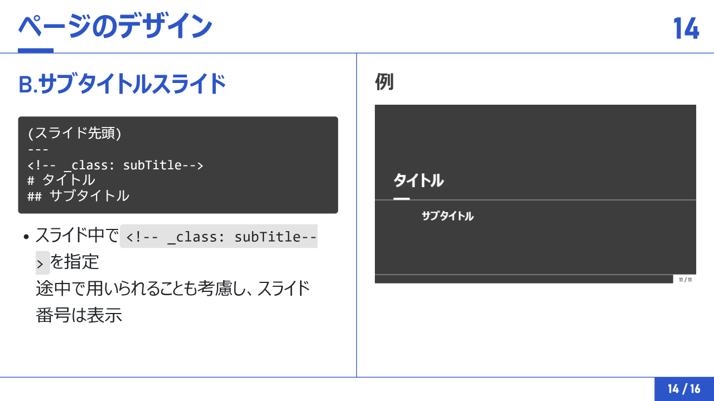
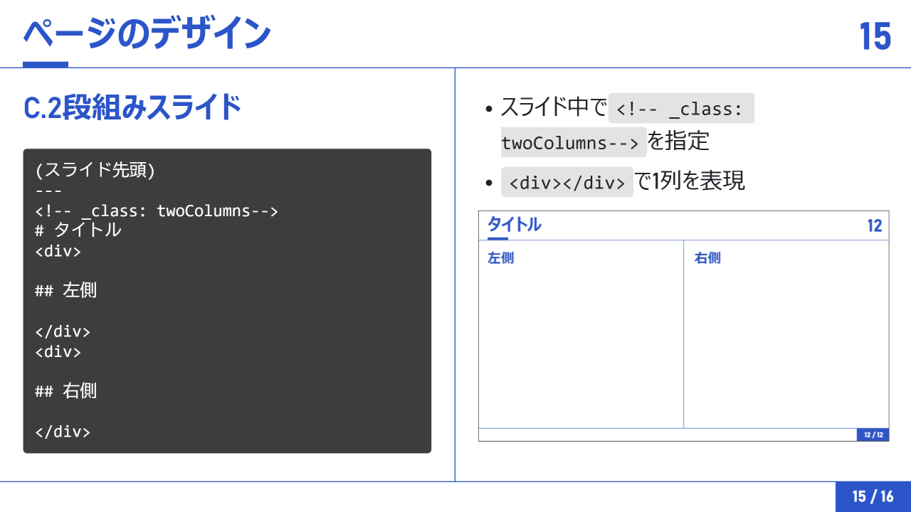
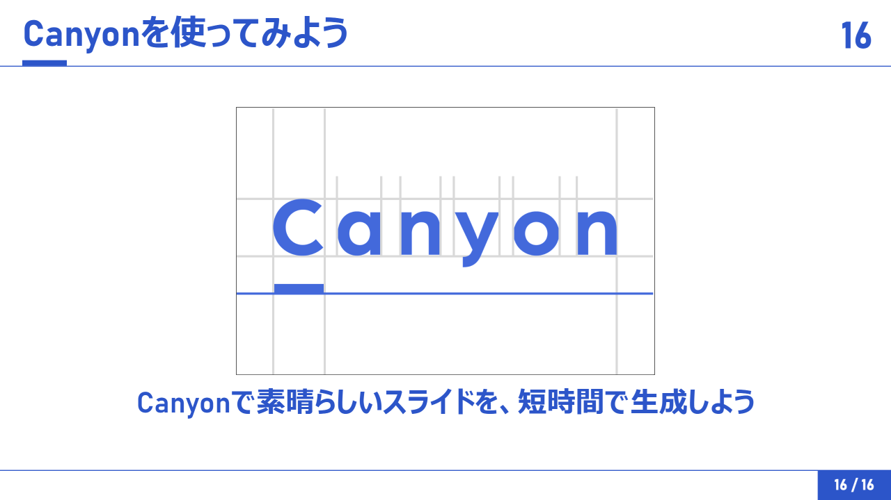

## 使い方ガイド
スライドテンプレートCanyonでかっこいいスライドを作ろう。(近日公開)で詳しい使い方を紹介しています。