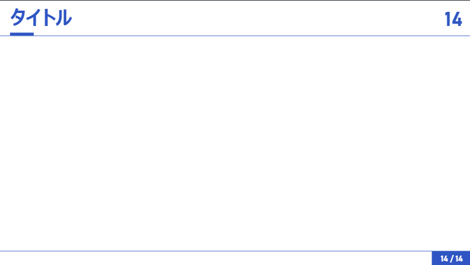
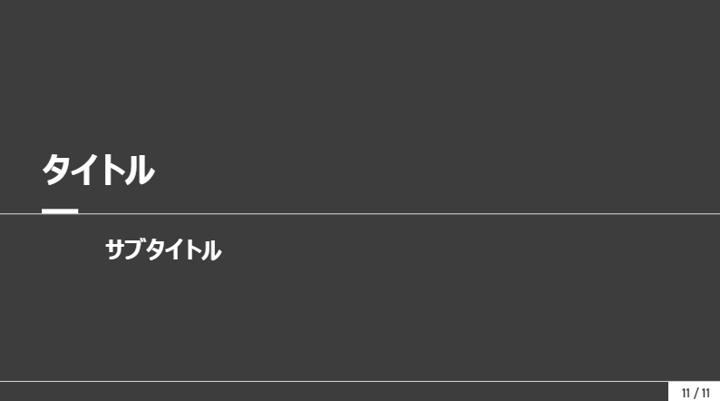

<!-- _class: title-->

# Canyon(with Marp)を使って、MDでスライド資料を作ろう。
## 世界一使いやすいスライドテンプレート

2025/02/17
じゅーるで(Jzurde)

---
<!-- _class: subTitle-->

# Marpとは

---
<!-- _class: twoColumns-->
# Marp
<div>


*https://marpit.marp.app/ から引用*

- マークダウン(MD)からスライドをつくるためのフレームワーク
<div class="box blue">
PowerPoint等をMD形式で記述して作ることができる。
</div>

</div>
<div>

### デフォルトテーマ

*このスライドをデフォルトテーマで表示した例*
- 要素が縦に整列するし、装飾等も必要最低限
</div>

---
<!-- _class: subTitle-->

# Canyonのコンセプトと使い方
## 世界一使いやすいスライドテンプレート

---
<!-- _class: twoColumns-->
# Canyonとは
<div>


<div class="box blue">

Canyonは**枠線の美しさ**を重視したスライドテンプレート
</div>

</div>
<div>

## コンセプト
### 詰め込みスライド
- スライドにしてはやや多めの情報を詰め込みたいとき(発表スライド等)を想定したデザイン

### 微調整のいらないデザイン
- 枠線を用いたゾーニングにより、要素間の余白等が気になりづらく、微調整等がいらないデザイン

</div>

---
<!-- _class: twoColumns-->
# 基本的な使い方
<div>

## 初期スライド

- 初期スライドはページ番号を2箇所含む

</div>
<div>

## タイトルを追加

- 最初のタイトル`# タイトル`がスライド上部に固定されて表示される

</div>

---
<!-- _class: subTitle-->

# Canyonのコンポーネント
## コンポーネントを用いてスライドをより分かりやすくする
コンポーネントを使えば、手間を掛けずにスライドをよりリッチにすることができる

---
<!-- _class: twoColumns-->
# 使えるコンポーネント
<div>

## 1.箱
```
<div class="box {color}">

## ヘッダー
中身

</div>
```
- colorを指定しなければ灰色の装飾なしの箱になる
- colorには青: `blue`、緑: `green`、黄色: `yellow`、赤: `red`のいずれかが入る

</div>
<div>

### 例
<div class="box">

## ヘッダー
中身

</div>
<div class="box blue">

## ヘッダー
中身

</div>
<div class="box yellow">

## ヘッダー
中身

</div>

</div>

---
<!-- _class: twoColumns-->
# 使えるコンポーネント
<div>

## 2. タグ
```
<span class="tag {theme}">
中身
</span>
```
- themeには、`main`(: スライドのメインカラー)あるいは、`accent`(: スライドのアクセントカラー)のいずれかが入る

### 例

<span class="tag accent">
重要
</span>
<span class="tag main">
検討
</span>

</div>
<div>

## 3. ハイライト
```
文章中で<mark>ここが重要</mark>です。
```
文章中で<mark>ここが重要</mark>です。

## 4. 数式
```
$x = \frac{-b±\sqrt{b^2-4ac}}{2a}$
```
$$x = \frac{-b±\sqrt{b^2-4ac}}{2a}$$

</div>

---
<!-- _class: twoColumns-->
# 使えるコンポーネント
<div>

## 5. 矢印
```
<span class="uparrow {theme}"></span>
<span class="downarrow {theme}"></span>
```
- themeには、`main`(デフォルト)(: スライドのメインカラー)あるいは、`accent`(: スライドのアクセントカラー)のいずれかを指定可

### 例


<span class="uparrow"></span>
<span class="downarrow accent"></span>

</div>
<div>

## 6.コードブロック
```
‘‘‘
document.getElementById("hello").innerHTML="aa"
‘‘‘
文章中で変数‘hello‘等をコードとして引用
```
### 実行例
```
document.getElementById("hello").innerHTML="aa"
```

文章中で変数`hello`等をコードとして引用

※`(: クォーテーションマーク)を用いてください

</div>

---
<!-- _class: twoColumns-->
# 使えるコンポーネント
<div>

## 7. 枠付き画像
```

```
- 画像のオプションに`border`を指定する
- 複数のオプションがある場合は``のように空白で区切る


</div>
<div>

### 例


</div>

---
<!-- _class: subTitle-->

# Canyonのページデザイン
## 特殊ページのバリエーション
タイトルやサブタイトルは専用のページを使う

---
<!-- _class: twoColumns-->
# ページのデザイン
<div>

## A.タイトルスライド
```
(スライド先頭)
---
<!-- _class: title-->
# タイトル
## サブタイトル
2025/02/25
```
- スライド中で`<!-- _class: title-->`を指定
- スライド番号が非表示

</div>
<div>

### 例


</div>

---
<!-- _class: twoColumns-->
# ページのデザイン
<div>

## B.サブタイトルスライド
```
(スライド先頭)
---
<!-- _class: subTitle-->
# タイトル
## サブタイトル
```
- スライド中で`<!-- _class: subTitle-->`を指定
  途中で用いられることも考慮し、スライド番号は表示

</div>
<div>

### 例


</div>

---
<!-- _class: twoColumns-->
# ページのデザイン
<div>

## C.2段組みスライド
```
(スライド先頭)
---
<!-- _class: twoColumns-->
# タイトル
<div>

## 左側

</div>
<div>

## 右側

</div>
```

</div>
<div>

- スライド中で`<!-- _class: twoColumns-->`を指定
- `<div></div>`で1列を表現


</div>

---
# Canyonを使ってみよう

<center>

## Canyonで素晴らしいスライドを、短時間で生成しよう
</center>
